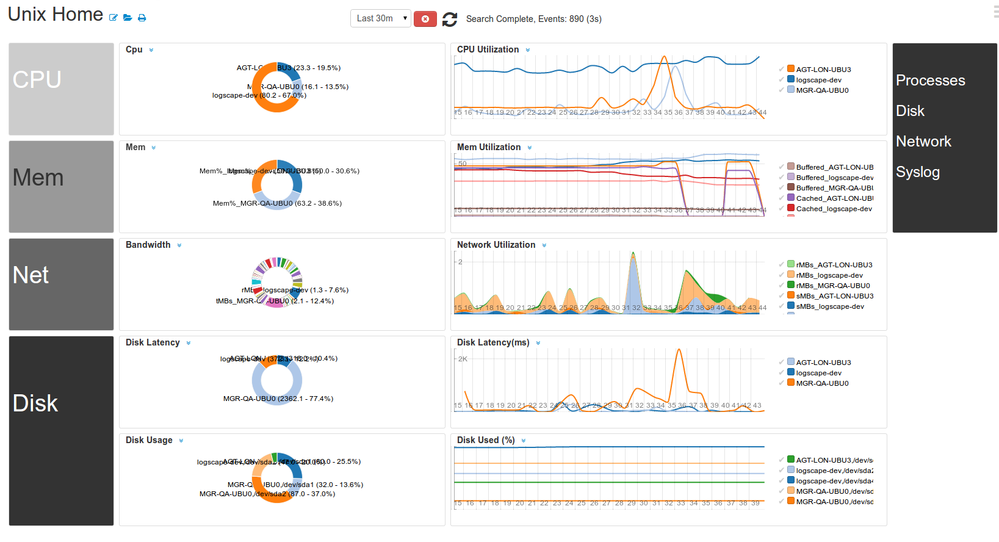
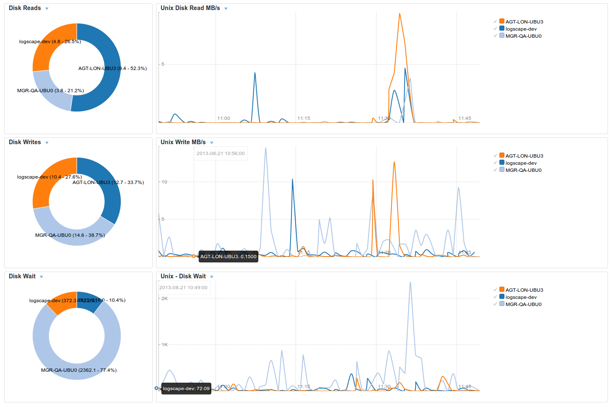
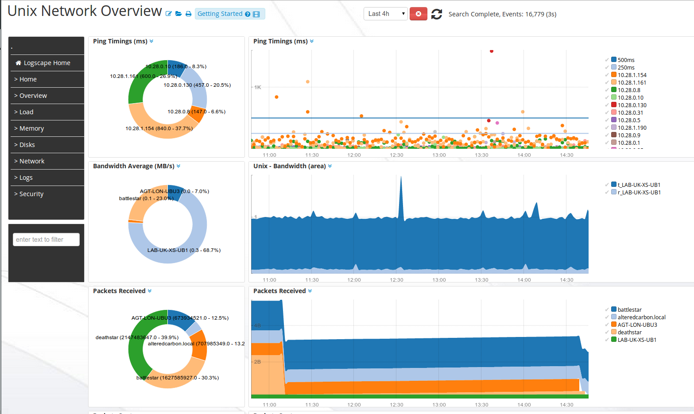
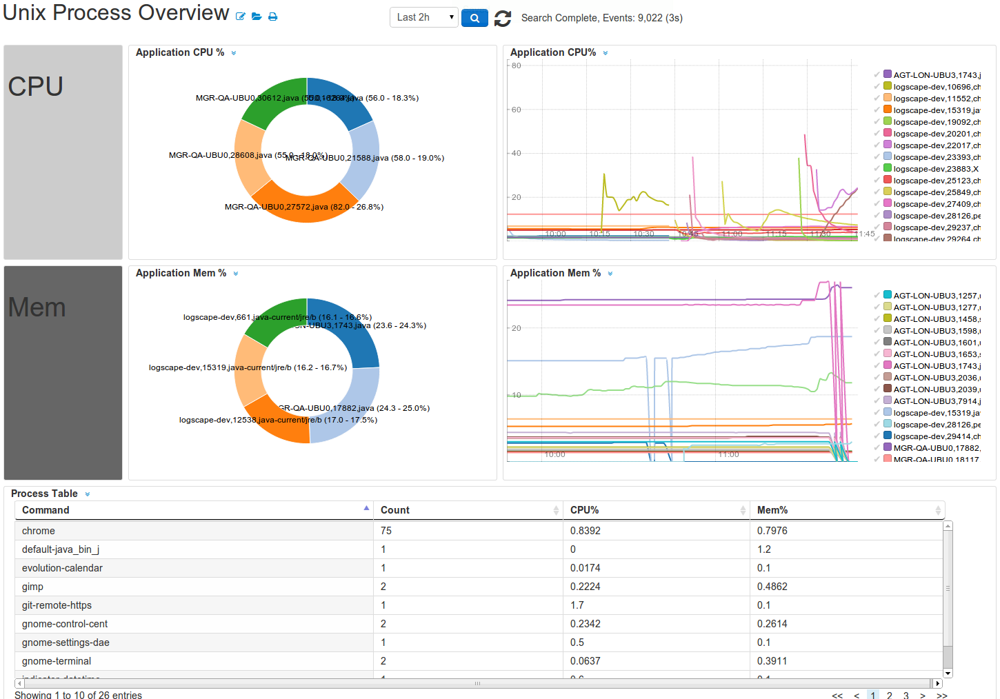

UnixApp-1.0
===========

The UnixApps monitors disk,network and system health.

## Prequisites

The following commands should be available from the command-line. They are available in most default Linux/Unix installations. 

	sar needs to be installed.
	iostat is required for disk performance metrics 

## Downloads 

 * [UnixApp-1.1.zip](https://github.com/logscape/unixapp/raw/master/dist/UnixApp-1.1.zip)

## Overview

The home page gives you an estate wide view of your servers performance and health. Identify quickly when your servers are struggling under load. 

 

## Disk Performance

Shows your disk throughput and disk latency. It is useful for monitoring hosts running disk-bound applications such as databases and webservers. 

 

## Network Throughput 

 
## Process Activity  

 
